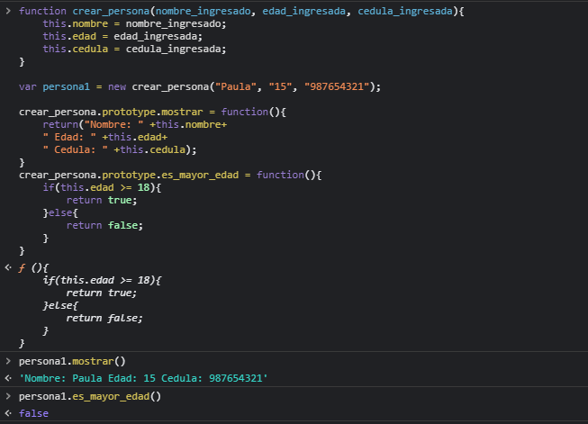
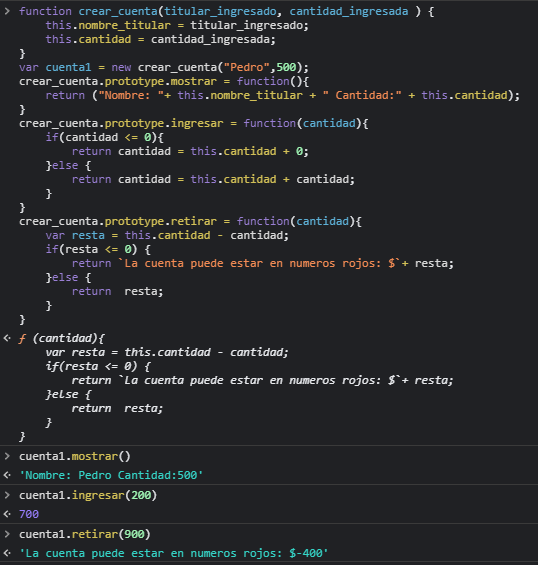
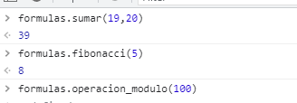
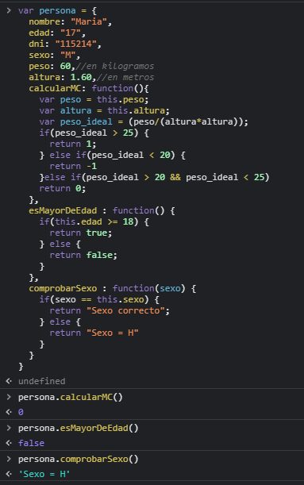
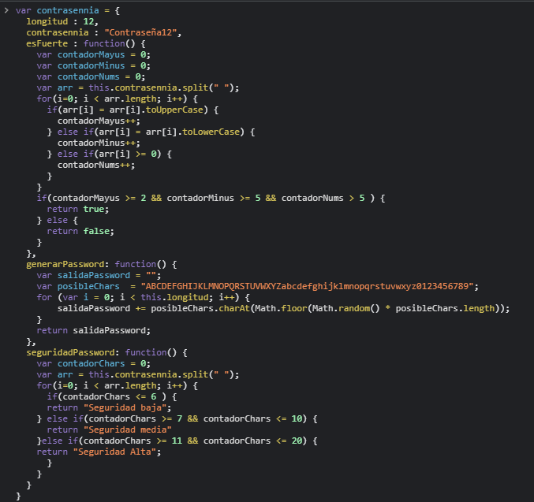
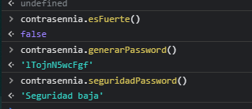
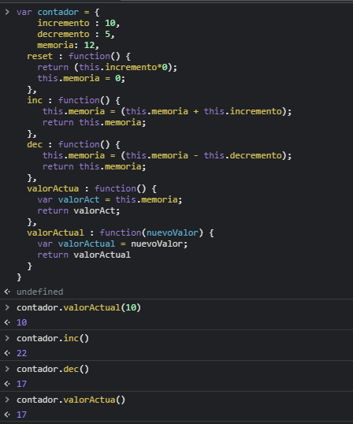
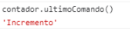
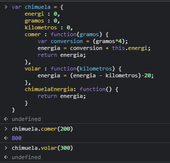
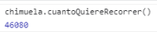

# METODOS CONSTRUCTORES, OBJETOS Y CLASES  

## PARTICIPANTE: Brissa Higuita Patiño

##  1: Crear un metodo constructor llamada persona. Sus atributos son: nombre, edad y cedula. Construye los siguientes métodos para la clase:

## 1.1: mostrar(): Muestra los datos de la persona.

## 1.2: es_mayor_de_edad(): Devuelve un valor lógico indicando si es mayor de edad.

```javascript
function crear_persona(nombre_ingresado, edad_ingresada, cedula_ingresada){
	this.nombre = nombre_ingresado;
	this.edad = edad_ingresada;
	this.cedula = cedula_ingresada;
}

var persona1 = new crear_persona("Paula", "15", "987654321");

crear_persona.prototype.mostrar = function(){
	return("Nombre: " +this.nombre+ 
	" Edad: " +this.edad+ 
	" Cedula: " +this.cedula);
}
crear_persona.prototype.es_mayor_edad = function(){
	if(this.edad >= 18){
		return true;
	}else{
		return false;
	}
}
```

### EVIDENCIA:



## 2.Crea un metodo constructor llamado cuenta que tendrá los siguientes atributos: titular (que es nombre de la persona) y cantidad. El titular será obligatorio y la cantidad es opcional. Construye los siguientes métodos para el metodo:

## 2.1 mostrar(): Muestra los datos de la cuenta. 

## 2.2 ingresar(cantidad): se ingresa una cantidad a la cuenta, si la cantidad introducida es negativa, no se hará nada. 

## 2.3 retirar(cantidad): se retira una cantidad a la cuenta. La cuenta puede estar en números rojos.

```javascript
function crear_cuenta(titular_ingresado, cantidad_ingresada ) {
    this.nombre_titular = titular_ingresado;
    this.cantidad = cantidad_ingresada;
}
var cuenta1 = new crear_cuenta("Pedro",500);
crear_cuenta.prototype.mostrar = function(){
    return ("Nombre: "+ this.nombre_titular + " Cantidad:" + this.cantidad);
}
crear_cuenta.prototype.ingresar = function(cantidad){
    if(cantidad <= 0){
        return cantidad = this.cantidad + 0;
    }else {
        return cantidad = this.cantidad + cantidad;
    }
}
crear_cuenta.prototype.retirar = function(cantidad){
    var resta = this.cantidad - cantidad;
    if(resta <= 0) {
        return `La cuenta puede estar en numeros rojos: $`+ resta; 
    }else {
        return  resta;
    }
}
```

### EVIDENCIA:



## 3. Crear un metodo constructor llamado formulas. Construye los siguiente metodos para la clase:

## 3.1 sumar(entero, entero) 
## 3.2 fibonacci(cantidad) a partir de una entero sacar los numeros 
## 3.3 operacion_modulo(cantidad) a partir de una cantidad mostrar cuales dan residuo 0 3.4 primos(cantidad) a partir de una cantidad mostrar cuales son numeros primos

```javascript
var formulas = {
    sumar : function(valor_a, valor_b){
        var suma = valor_a + valor_b;
        return suma;
    },
    fibonacci : function(cantidad){
        var a=0;
        var b=1;
        for(i=0; i<cantidad;i++){
        var numeroTemporal=a;
        a=b;
        b=numeroTemporal+b;
    }
    return b;
    },
    operacion_modulo:function(cantidad){
        for (let i = 2; i <= cantidad; i++) { 
  for (let j = 2; j < i; j++) { 
    if (i % j == 0) continue nextPrime; 
  }
  alert( i ); 
}
    }
}
```

### EVIDENCIA:



## 4. Crear un metodo constructor llamado persona. Sus atributos son: nombre, edad, DNI, sexo (H hombre, M mujer), peso y altura Construye los siguiente metodos para la clase:

## 4.1 calcularIMC(): calculara si la persona esta en su peso ideal (peso en kg/(altura^2 en m)), si esta fórmula devuelve un valor menor que 20, la función devuelve un -1, si devuelve un número entre 20 y 25 (incluidos), significa que esta por debajo de su peso ideal la función devuelve un 0 y si devuelve un valor mayor que 25 significa que tiene sobrepeso, la función devuelve un 1. Te recomiendo que uses constantes para devolver estos valores. 
## 4.2 esMayorDeEdad(): indica si es mayor de edad, devuelve un booleano. 
## 4.3 comprobarSexo(char sexo): comprueba que el sexo introducido es correcto. Si no es correcto, sera H.

```javascript
var persona = {
  nombre: "Maria",
  edad: "17",
  dni: "115214",
  sexo: "M",
  peso: 60,//en kilogramos
  altura: 1.60,//en metros
  calcularMC: function(){
    var peso = this.peso;
    var altura = this.altura;
    var peso_ideal = (peso/(altura*altura));
    if(peso_ideal > 25) {
      return 1;
    } else if(peso_ideal < 20) {
      return -1
    }else if(peso_ideal > 20 && peso_ideal < 25)
    return 0;
  },
  esMayorDeEdad : function() {
    if(this.edad >= 18) {
      return true;
    } else {
      return false;
    }
  },
  comprobarSexo : function(sexo) {
    if(sexo == this.sexo) {
      return "Sexo correcto";
    } else {
      return "Sexo = H"
    }
  }
}
```

### EVIDENCIA:



## 5.Crear un metodo constructor llamado contraseña. Sus atributos longitud y contraseña Construye los siguiente metodos para la clase:
## 5.1 esFuerte(): devuelve un booleano si es fuerte o no, para que sea fuerte debe tener mas de 2 mayúsculas, mas de 1 minúscula y mas de 5 números. 
## 5.2 generarPassword(): genera la contraseña del objeto con la longitud que tenga. 
## 5.3 seguridadPaswword(); indicar si la contraseña es debil contiene entre 1 a 6 caracteres (caracteres numeros y letras), media (7 a 10 caracteres numeros y letras) o fuerte (11 a 20 caracteres letras y caracteres especiales)

```javascript
var contrasennia = {
  longitud : 12,
  contrasennia : "Contraseña12",
  esFuerte : function() {
    var contadorMayus = 0;
    var contadorMinus = 0;
    var contadorNums = 0;
    var arr = this.contrasennia.split(" ");
    for(i=0; i < arr.length; i++) {
      if(arr[i] = arr[i].toUpperCase) {
        contadorMayus++;
      } else if(arr[i] = arr[i].toLowerCase) {
        contadorMinus++;
      } else if(arr[i] >= 0) {
        contadorNums++;
      }
    }
    if(contadorMayus >= 2 && contadorMinus >= 5 && contadorNums > 5 ) {
      return true;
    } else {
      return false;
    }
  },
  generarPassword: function() {
    var salidaPassword = "";
    var posibleChars  = "ABCDEFGHIJKLMNOPQRSTUVWXYZabcdefghijklmnopqrstuvwxyz0123456789";
    for (var i = 0; i < this.longitud; i++) {
        salidaPassword += posibleChars.charAt(Math.floor(Math.random() * posibleChars.length));
    }
    return salidaPassword;
  },
  seguridadPassword: function() {
    var contadorChars = 0;
    var arr = this.contrasennia.split(" ");
    for(i=0; i < arr.length; i++) {
      if(contadorChars <= 6 ) {
      return "Seguridad baja";
    } else if(contadorChars >= 7 && contadorChars <= 10) {
      return "Seguridad media"
    }else if(contadorChars >= 11 && contadorChars <= 20) {
    return "Seguridad Alta";
      }
    }
  }
}
```
### EVIDENCIA:




## 6.Implementar un objeto que modele un contador. Un contador se puede incrementar o decrementar, recordando el valor actual. Al resetear un contador, se pone en cero. Además es posible indicar directamente cual es el valor actual. Este objeto debe entender los siguientes mensajes: 
## 6.1 reset() 
## 6.2 inc() 
## 6.3 dec() 
## 6.4 valorActual() 
## 6.5 valorActual(nuevoValor) 
###P.ej. si se evalúa la siguiente secuencia contador.valorActual(10) contador.inc() contador.inc() contador.dec() contador.inc() contador.valorActual() el resultado debe ser 12.

```javascript
var contador = {
    incremento : 10,
    decremento : 5,
    memoria: 12,
  reset : function() {
    return (this.incremento*0);
    this.memoria = 0;
  },
  inc : function() {
     this.memoria = (this.memoria + this.incremento);
     return this.memoria;
  },
  dec : function() {
     this.memoria = (this.memoria - this.decremento);
     return this.memoria;
  },
  valorActua : function() {
    var valorAct = this.memoria;
    return valorAct;
  },
  valorActual : function(nuevoValor) {
    var valorActual = nuevoValor;
    return valorActual 
  }
}
```

### EVIDENCIA:



## 8.Agregar al contador del ejercicio 6, la capacidad de recordar un String que representa el último comando que se le dio. Los Strings posibles son "reset", "incremento", "decremento" o "actualizacion" (para el caso de que se invoque valorActual con un parámetro). Para saber el último comando, se le envía al contador el mensaje ultimoComando(). En el ejemplo del ejercicio 3, si luego de la secuencia indicada se evalúa contador.ultimoComando() el resultado debe ser "incremento"

```javascript
var contador = {
    incremento : 10,
    decremento : 5,
    memoria: 12,
  reset : function() {
    return (this.incremento*0);
    this.memoria = 0;
  },
  inc : function() {
     this.memoria = (this.memoria + this.incremento);
     return this.memoria;
  },
  dec : function() {
     this.memoria = (this.memoria - this.decremento);
     return this.memoria;
  },
  valorActua : function() {
    var valorAct = this.memoria;
    return valorAct;
  },
  valorActual : function(nuevoValor) {
    var valorActual = nuevoValor;
    return valorActual 
  }
  ultimoComando = function(){
  	if(this.incremento == 10){
  		return "Incremento";
  	} else if(this.decremento == this.incremento){
  		return "Decremento";
  	} else if(this.memoria < 0){
  		return "reset";
  	}
  }
}
```

### EVIDENCIA:



## 8.Implementar un objeto que modele a Chimuela, una dragona de la que nos interesa saber qué energía tiene en cada momento, medida en joules. En el metodo constructor simpli�cado que nos piden implementar, las únicas acciones que vamos a contemplar son: cuando Chimuela come una cantidad de comida especi�cada en gramos, en este caso adquiere 4 joules por cada gramo, y cuando Chimuela vuela una cantidad de kilómetros, en este caso gasta un joule por cada kilómetro, más 10 joules de �costo �jo� de despegue y aterrizaje. La energía de Chimuela nace en 0. El objeto que implementa este metodo constructor de Chimuela, debe entender los siguientes mensajes: 

## 8.1 comer(gramos) 
## 8.2 volar(kilometros) 
## 8.3 energia() P.ej. si sobre un REPL(Read-Eval-Print-Loop)(Lectura-Evaluación-Impresión) recién lanzado se evalúa la siguiente secuencia Chimuela.comer(100) Chimuela.volar(10) Chimuela.volar(20) Chimuela.energia() el resultado debe ser 350.

```javascript
var chimuela = {
    energi : 0,
    gramos : 0,
    kilometros : 0,
    comer : function(gramos) {
        var conversion = (gramos*4);
        energia = conversion + this.energi;
        return energia;
    },
    volar : function(kilometros) {
        energia = (energia - kilometros)-20;
    },
    chimuelaEnergia: function() {
        return energia;
    }
}
```
### EVIDENCIA:



## 9. Agregar al metodo constructor de Chimuela del ejercicio 8, la capacidad de entender estos mensajes: estaDebil(), Chimuela está débil si su energía es menos de 50. estaFeliz(), Chimuela está feliz si su energía está entre 500 y 1000. cuantoQuiereVolar(), que es el resultado de la siguiente cuenta. De base, quiere volar (energía / 5) kilómetros, p.ej., si tiene 120 de energía, quiere volar 24 kilómetros. Si la energía está entre 300 y 400, entonces hay que sumar 10 a este valor, y si es múltiplo de 20, otros 15. Entonces, si Chimuela tiene 340 de energía, quiere volar 68 + 10 + 15 = 93 kilómetros. Para probar esto, sobre un REPL recién lanzado darle de comer 85 a Chimuela, así la energía queda en

```javascript
var chimuela = {
    energi : 0,
    gramos : 0,
    kilometros : 0,
    comer : function(gramos) {
        var conversion = (gramos*4);
        energia = conversion + this.energi;
        return energia;
    },
    volar : function(kilometros) {
        energia = (energia - kilometros)-20;
    },
    chimuelaEnergia: function() {
        return energia;
    }
    cuantoQuiereRecorrer : function() {
    	if(chimuela.energia < 50) {
    		return "Esta Debil";
    	}else {
    		energia = (energia/5);
    		energia = energia * 120;
    		return energia;
    	}
    }
}
```
### EVIDENCIA:


